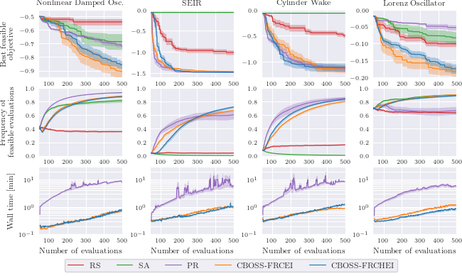

# Discovering Model Structure of Dynamical Systems with Combinatorial Bayesian Optimization

This repository is part of the submission at the Transactions in Machine Learning Research (TMLR) journal:

[Discovering Model Structure of Dynamical Systems with Combinatorial Bayesian Optimization](https://openreview.net/forum?id=2iOOvQmJBK)


[CBOSS](https://github.com/lucasrm25/CBOSS) is our novel Bayesian optimizer for model structure selection in system identification. Our method outperforms the state-of-the-art in constrained combinatorial optimization of black-box functions and has a favorable computational overhead compared to other BO methods.

## Abstract 

Deciding on a model structure is a fundamental problem in machine learning. In this paper we consider the problem of building a data-based model for dynamical systems from a library of discrete components. In addition to optimizing performance, we consider crash and inequality constraints that arise from additional requirements, such as real-time capability and model complexity. We address this task of model structure selection with a focus on dynamical systems and propose to search over potential model structures efficiently using a constrained combinatorial Bayesian Optimization (BO) algorithm. We propose expressive surrogate models suited for combinatorial domains and an acquisition function that can handle inequality and crash constraints. We provide simulated benchmark problems within the domain of equation discovery of nonlinear dynamical systems. Our method outperforms the state-of-the-art in constrained combinatorial optimization of black-box functions and has a favorable computational overhead compared to other BO methods. As a real-world application example, we apply our method to optimize the configuration of an electric vehicle's digital twin while ensuring its real-time capability for the use in one of the world's largest driving simulators.

## Installation

Clone this repository with the submodule flags:
```sh
git clone https://github.com/lucasrm25/Model-Structure-Selection-CBOSS.git --recurse-submodules
```

If you happen to clone this repository without the `--recurse-submodules` flag, please download the submodules manually as follows:
```sh
git submodule update --force --recursive --init --remote
```

Next, create a virtual environment with python version `3.10.0` and install the dependencies:
1. install the `CBO` dependencies:
    ```sh
    cd CBOSS
    pip install -e .
    ```

2. install the `PR` dependencies:
    ```sh
    cd bo_pr
    pip install -e .
    ```

## Running Benchmark Experiments

The main script for running equation discovery experiments is [run_equation_discovery.py](run_equation_discovery.py). See the help for more information on how to run it:
```sh
./run_equation_discovery.py --help
```

See also 

To reproduce the experiments as in the paper run the following scripts, switching the `experiment_name` variable to the desired experiment:
```sh
# get current timestamp
timestamp=$(date +"%Y%m%d-%H%M%S")

# ==> UNCOMMENT ONE OF THE FOLLOWING LINES:
# experiment_name="NonLinearDampedOscillator_k5"
# experiment_name="Lorenz_k3"
# experiment_name="SEIR_k3"
experiment_name="CylinderWake_k3"

number_of_reruns=10


# ==> CHOOSE ONE OF THE FOLLOWING EXPERIMENTS:

# ============ Main experiments ============ #
python3 run_equation_discovery.py -e ${experiment_name} -j 1 -r ${number_of_reruns} -m CBOSS -f FRCHEI_KPOLYDIFF_BS2 -i "${timestamp}"
python3 run_equation_discovery.py -e ${experiment_name} -j 1 -r ${number_of_reruns} -m CBOSS -f CHEI_KPOLYDIFF_BS2 -i "${timestamp}"
python3 run_equation_discovery.py -e ${experiment_name} -j 1 -r ${number_of_reruns} -m CBOSS -f FRCEI_KPOLYDIFF_BS2 -i "${timestamp}"

# ============ Ablation study: batch size ============ #
python3 run_equation_discovery.py -e ${experiment_name} -j 1 -r ${number_of_reruns} -m CBOSS -f FRCHEI_KPOLYDIFF_BS1 -i "${timestamp}"
python3 run_equation_discovery.py -e ${experiment_name} -j 1 -r ${number_of_reruns} -m CBOSS -f FRCHEI_KPOLYDIFF_BS4 -i "${timestamp}"

# ============ Ablation study: kernel type ============ #
python3 run_equation_discovery.py -e ${experiment_name} -j 1 -r ${number_of_reruns} -m CBOSS -f FRCHEI_KDIFF_BS2 -i "${timestamp}"
python3 run_equation_discovery.py -e ${experiment_name} -j 1 -r ${number_of_reruns} -m CBOSS -f FRCHEI_KPOLY_BS2 -i "${timestamp}"

# ============ Baselines ============ #
python3 run_equation_discovery.py -e ${experiment_name} -j 1 -r ${number_of_reruns} -m RS -i "${timestamp}"
python3 run_equation_discovery.py -e ${experiment_name} -j 1 -r ${number_of_reruns} -m SA -i "${timestamp}"
python3 run_equation_discovery.py -e ${experiment_name} -j 1 -r ${number_of_reruns} -m PR -i "${timestamp}"
```

Those will generate result files in the `results/<experiment_name>/main/` folder.

The general experiment configurations can be changed here: [configs_equation_discovery.yaml](configs_equation_discovery.yaml).


## Generating Benchmark Result Figures

After running the experiments you can generate the figures showing the optimization progress by running the following script:
```sh
python3 utils/plot__y_min_feas__vs__iter.py
```
The result pdf images will be saved to the [results/](results/) folder, for instance, `results/yminfeas_wall_nbrfeas__x__iter__main.pdf`: 




## Citation

If you use this code in your research, please cite the following paper:

```bibtex
@article{
    anonymous2023discovering,
    title={Discovering Model Structure of Dynamical Systems with Combinatorial Bayesian Optimization},
    author={Anonymous},
    journal={Submitted to Transactions on Machine Learning Research},
    year={2023},
    url={https://openreview.net/forum?id=2iOOvQmJBK},
    note={Under review}
}
```