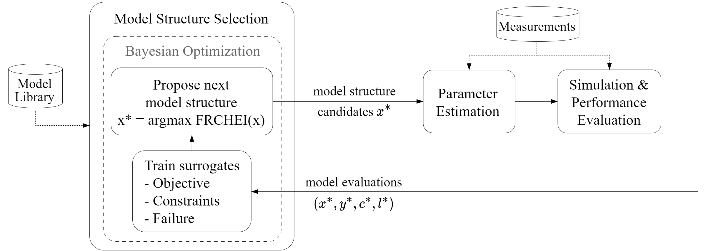

# Discovering Model Structure of Dynamical Systems with Combinatorial Bayesian Optimization

This repository is part of the submission at the Transactions in Machine Learning Research (TMLR) journal:

[Discovering Model Structure of Dynamical Systems with Combinatorial Bayesian Optimization](https://openreview.net/forum?id=2iOOvQmJBK)


## Model Structure Selection with CBOSS

[CBOSS](https://github.com/lucasrm25/CBOSS) is a **Bayesian Optimization** method used to solve **combinatorial optimization problems subject to inequality and crash constraints**:

$$
\begin{align}
    \boldsymbol x^* = \arg\min_{\boldsymbol x\in\mathcal X} & \quad f (\boldsymbol x) 
    \\
    s.t. & \quad g_j(\boldsymbol x) \leq 0 \quad  \forall j \in \{1, \dots, M\} \\
         & \quad h(\boldsymbol x) = 1
\end{align}
$$

where 
- $x$ is a vector of categorical decision variables denoted as $\boldsymbol x \in \mathcal X$, defined over the combinatorial domain $\mathcal X = \mathcal X_1 \times \mathcal X_2 \times\dots \times \mathcal X_d$ with $d$ categorical decision variables with respective cardinalities $k_1, \dots, k_d$.
- $f: \mathcal X \to \mathbb R$ is the objective function.
- $g_j: \mathcal X \to \mathbb R$ are the inequality constraints.
- $h: \mathcal X \to \{0,1\}$ are the binary equality constraints indicating evaluation "crashes".

<br>

[CBOSS](https://github.com/lucasrm25/CBOSS) can be used as a [model structure selection](https://en.wikipedia.org/wiki/Model_selection) method in system identification to learn the optimal structure of differential equations (parameterized with binary/categorical decision variables) from noisy measurements:
1. At each iteration, CBOSS proposes a new model structure candidate $\boldsymbol x$
2. The free model coefficients, resulting from the model structure $\boldsymbol x$, is then identified from data using parameter estimation techniques. 
3. Finally, the resulting identified model (structure + parameters) is simulated and evaluated according to a given performance function $f(\boldsymbol x)$ a constraint function $g(\boldsymbol x)$ and a crash constraint $h(\boldsymbol x)$.
4. The model evaluation is then used as feedback for CBOSS to guide the search for better model structures

<br>




<br>

[CBOSS](https://github.com/lucasrm25/CBOSS) is ideal for:
- **expensive-to-evaluate** models
- models that can **crash** (due to instabilities or invalid resulting model structure composition). CBOSS learns and avoids crash regions as a function of the model structure.
- considering additional requirements that can be formulated as **inequality constraints**, e.g. computational complexity requirements (real-time constraints), model regularization, etc.

<br>

We explore benchmark problems in the context of system identification of low dimensional dynamical systems.
We parameterize the model structure with a vector of categorical decision variables, which add or remove terms in the differential equations.
Below we can see the progress of [CBOSS](https://github.com/lucasrm25/CBOSS) in learning better model structures for two dynamical systems, Cylinder Wake and Lorenz oscillator:

<table>
 <tr>
   <th>Iteration 10</th>
   <th>Iteration 100</th>
   <th>Iteration 250</th>
   <th>Iteration 500</th>
 </tr>
 <tr>
   <td>  </td>
   <td>  </td>
   <td>  </td>
   <td>  </td>
 </tr>
 <tr>
   <td>  </td>
   <td>  </td>
   <td>  </td>
   <td>  </td>
 </tr>
</table>


## Running Benchmark Experiments

The main script for running equation discovery experiments is [run_equation_discovery.py](run_equation_discovery.py). See the help for more information on how to run it:
```sh
./run_equation_discovery.py --help
```

See also 

To reproduce the experiments as in the paper run the following scripts, switching the `experiment_name` variable to the desired experiment:
```sh
# get current timestamp
timestamp=$(date +"%Y%m%d-%H%M%S")

# ==> UNCOMMENT ONE OF THE FOLLOWING LINES:
# experiment_name="NonLinearDampedOscillator_k5"
# experiment_name="Lorenz_k3"
# experiment_name="SEIR_k3"
experiment_name="CylinderWake_k3"

number_of_reruns=10


# ==> CHOOSE ONE OF THE FOLLOWING EXPERIMENTS:

# ============ Main experiments ============ #
python3 run_equation_discovery.py -e ${experiment_name} -j 1 -r ${number_of_reruns} -m CBOSS -f FRCHEI_KPOLYDIFF_BS2 -i "${timestamp}"
python3 run_equation_discovery.py -e ${experiment_name} -j 1 -r ${number_of_reruns} -m CBOSS -f CHEI_KPOLYDIFF_BS2 -i "${timestamp}"
python3 run_equation_discovery.py -e ${experiment_name} -j 1 -r ${number_of_reruns} -m CBOSS -f FRCEI_KPOLYDIFF_BS2 -i "${timestamp}"

# ============ Ablation study: batch size ============ #
python3 run_equation_discovery.py -e ${experiment_name} -j 1 -r ${number_of_reruns} -m CBOSS -f FRCHEI_KPOLYDIFF_BS1 -i "${timestamp}"
python3 run_equation_discovery.py -e ${experiment_name} -j 1 -r ${number_of_reruns} -m CBOSS -f FRCHEI_KPOLYDIFF_BS4 -i "${timestamp}"

# ============ Ablation study: kernel type ============ #
python3 run_equation_discovery.py -e ${experiment_name} -j 1 -r ${number_of_reruns} -m CBOSS -f FRCHEI_KDIFF_BS2 -i "${timestamp}"
python3 run_equation_discovery.py -e ${experiment_name} -j 1 -r ${number_of_reruns} -m CBOSS -f FRCHEI_KPOLY_BS2 -i "${timestamp}"

# ============ Baselines ============ #
python3 run_equation_discovery.py -e ${experiment_name} -j 1 -r ${number_of_reruns} -m RS -i "${timestamp}"
python3 run_equation_discovery.py -e ${experiment_name} -j 1 -r ${number_of_reruns} -m SA -i "${timestamp}"
python3 run_equation_discovery.py -e ${experiment_name} -j 1 -r ${number_of_reruns} -m PR -i "${timestamp}"
```

Those will generate result files in the `results/<experiment_name>/main/` folder.

The general experiment configurations can be changed here: [configs_equation_discovery.yaml](configs_equation_discovery.yaml).


## Generating Benchmark Result Figures

After running the experiments you can generate the figures showing the optimization progress by running the following script:
```sh
python3 utils/plot__y_min_feas__vs__iter.py
```
The result pdf images will be saved to the [results/](results/) folder, for instance, `results/yminfeas_wall_nbrfeas__x__iter__main.pdf`: 


## Installation

Clone this repository with the submodule flags:
```sh
git clone https://github.com/lucasrm25/Model-Structure-Selection-CBOSS.git --recurse-submodules
```

If you happen to clone this repository without the `--recurse-submodules` flag, please download the submodules manually as follows:
```sh
git submodule update --force --recursive --init --remote
```

Next, create a virtual environment with python version `3.10.0` and install the dependencies:
1. install the `CBO` dependencies:
    ```sh
    cd CBOSS
    pip install -e .
    ```

2. install the `PR` dependencies:
    ```sh
    cd bo_pr
    pip install -e .
    ```


## Citation

If you use this code in your research, please cite the following paper:

```bibtex
@article{
    anonymous2023discovering,
    title={Discovering Model Structure of Dynamical Systems with Combinatorial Bayesian Optimization},
    author={Anonymous},
    journal={Submitted to Transactions on Machine Learning Research},
    year={2023},
    url={https://openreview.net/forum?id=2iOOvQmJBK},
    note={Under review}
}
```